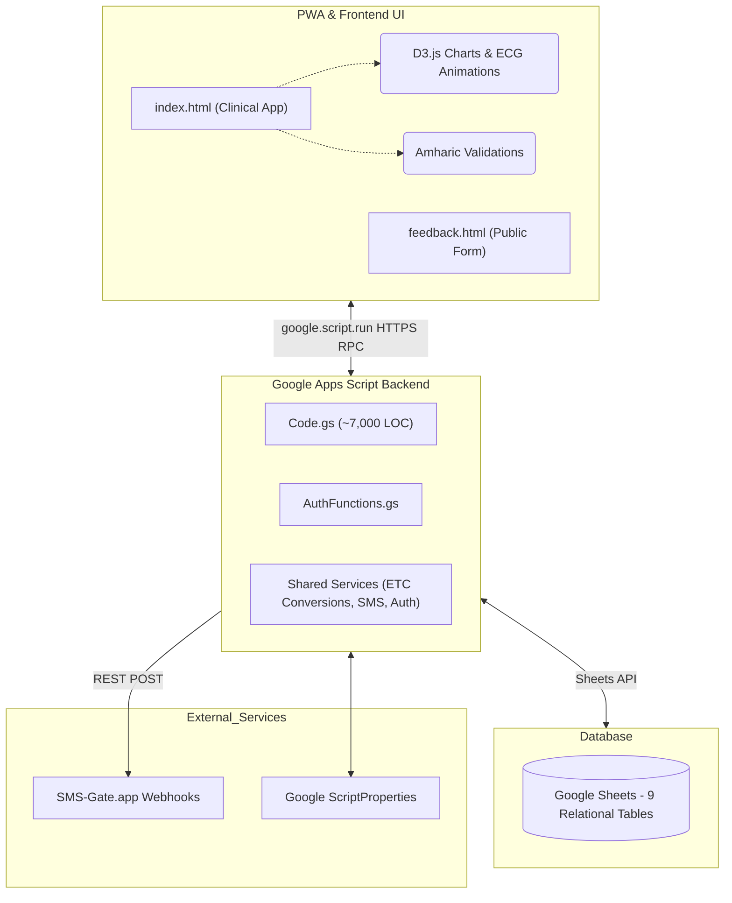
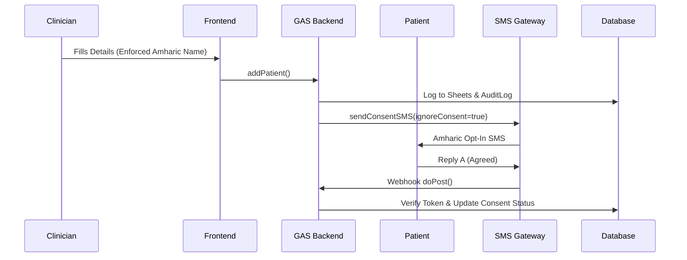

# NARTS — System Architecture & Workflows

> **Non-Communicable Disease Appointment & Retention Tracking System**
> *St. Peter's Specialized Hospital · Addis Ababa, Ethiopia*
> *Document v1.1 · March 2026*

---

## 1. Executive Summary

NARTS is a **cloud-based, mobile-compatible clinical workflow management system** purpose-built for NCD chronic care. It replaces paper-based appointment registers at St. Peter's NCD clinic with a fully digital platform delivering automated Amharic SMS, real-time patient retention tracking, interactive dashboard animations, and a complete audit trail. 

> [!NOTE]
> Designed for resilience, the system is actively transitioning from a pure Google Apps Script (GAS) deployment to a decentralized, Offline-First Progressive Web App (PWA) to ensure robust clinical connectivity in low-bandwidth environments.

---

## 2. System Architecture

### 2.1 UI Aesthetics & Branding ("St. Peter's Theme")

The NARTS presentation layer utilizes a stringent design paradigm established exclusively for the NCD department, focusing on modern utility and premium visual hierarchy:

- **Glassmorphism:** All clinical panels and modals use translucent backgrounds (`backdrop-filter: blur()`) superimposed on abstract, dynamic gradient backgrounds.
- **Micro-Animations:** Critical loading states (e.g., Dashboard initializing) trigger high-fidelity medical micro-animations (ECG traces, Stethoscope loops) rather than generic spinners.
- **Typography:** Relies on modern, crisp sans-serif Google Fonts. Primary data reads utilize `Inter`, headers utilize `Outfit`, and medical numbering operates in `Roboto Mono`.
- **Neon Accentuation:** System states are communicated via vivid hex codes (`#92fe9d` for Success, `#f36523` for Warnings, `#00c9ff` for Primary Actions).

---

## 3. Data Schema

### 3.1 `Patients` Sheet
| Col | Field | Type | Description |
|-----|-------|------|-------------|
| A | `patient_id` | String | Unique patient identifier (P001, P002…) |
| B | `patient_name` | String | Full name (Strict mapped to Unicode `[\u1200-\u137F]`) |
| C | `mrn` | String | Medical Record Number |
| D | `phone_number` | String | Normalized Ethiopian format (+251…) |
| E | `conditions` | String | Primary diagnosis: `DM` / `HTN` / `DM and HTN` / `Other` |

> [!WARNING]
> All new patient names are filtered client-side and server-side to restrict non-Amharic characters.

### 3.2 `Users` Sheet
| Col | Field | Type | Description |
|-----|-------|------|-------------|
| C | `user_phone` | String | Login phone number |
| D | `user_role` | String | `Admin` / `Physician` / `Nurse` / `HEW` |
| G | `status` | String | `Active` / `Inactive` / `Disabled` |
| I | `password` | String | Salted SHA-256 hash |

---

## 4. Core Workflows

### 4.1 Patient Registration & Consent Flow

### 4.2 Application Environments & Limitations

#### The Google Apps Script (GAS) Sandbox
Currently, the UI is served natively by `HtmlService` within a Google domain (`script.googleusercontent.com`).
> [!CAUTION]  
> **Platform Limitation:** Google strips the `allow="microphone"` permission attribute from its secure iframes. 
> This means native web APIs like `SpeechRecognition` (Web Speech API) are unconditionally blocked. Voice dictation currently relies on a graceful fallback UI modal instructing users to trigger **OS-level voice typing** (`Win + H` or Android Gboard) until the standalone PWA migration replaces the iframe.

#### The Offline-First PWA (Roadmap)
NARTS is migrating to an independent **Progressive Web App (PWA)** architecture (`narts-PWA`) deployed outside Google's rigid iframe constraints (e.g., Vercel).
1. **IndexedDB Local Storage:** To handle clinical connectivity drops, data mutations will write locally to IndexedDB first.
2. **Background Sync:** A Service Worker will flush pending mutations sequentially back to the GAS REST API once internet is restored.
3. **Web API unlocking:** By removing the `script.google.com` iframe, hardware APIs (Camera for QR codes, Web Speech API for Amharic dictation) will gain full native authorization.

---

## 5. Security Architecture

| Layer | Implementation |
|-------|---------------|
| **Authentication** | Phone + password (salted SHA-256, per-app salt) |
| **Session Management** | Token-keyed ScriptProperties — no shared server state |
| **XSS Prevention** | Global `esc()` / `escapeHtml()` on all `innerHTML` content |
| **Voice Data Privacy** | Handled completely natively by OS fallback; browser mic APIs securely disabled by sandbox block. |
| **Data at Rest** | Google Sheets with access-restricted sharing settings |
| **Audit Trail** | AuditLog sheet — every data mutation is logged with user, action, and timestamp |

---

## 6. Ethiopian Calendar Integration

The system provides a **bidirectional Gregorian ↔ Ethiopian Calendar converter**, functioning seamlessly for appointments:

| Period | Ethiopian Clock | Approximate EAT |
|--------|----------------|----------------|
| ጠዋት (Morning) | 12:00–6:00 EC | 06:00–12:00 EAT |
| ረፋድ (Late Morning) | 6:00–7:00 EC | 12:00–13:00 EAT |
| ከሰዓት (Afternoon) | 7:00–12:00 EC | 13:00–18:00 EAT |

---

## 7. Technology Stack

| Component | Technology |
|-----------|-----------|
| Backend Runtime | Google Apps Script (V8 Engine) |
| Frontend | Vanilla HTML / CSS / Vanilla JS (No heavyweight frameworks) |
| Data Visualization | D3.js v7 + SVG Micro-animations |
| Typography | Google Fonts (Inter, Outfit, Roboto Mono) |
| Database | Google Sheets (relational schema) |
| Sync Engine (Upcoming) | LocalStorage & IndexedDB PWA wrapper |

---

*© 2026 St. Peter's Specialized Hospital — NCD Department. Internal Use Only.*
