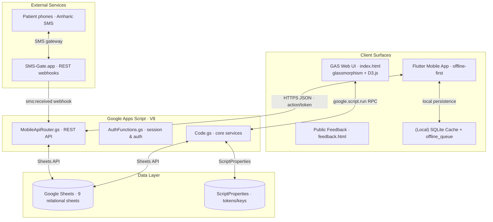

# NARTS — System Architecture, Backend API & Sync Reference

> **Non-Communicable Disease Appointment & Retention Tracking System**
> *Kidus Petros Hospital · Addis Ababa, Ethiopia*
> *Document v1.2 · September 2026*

---

## 1. Executive Summary

NARTS is a **secure, cloud-based clinical workflow management system** purpose-built for NCD chronic care at Kidus Petros Hospital. It replaces paper appointment registers with a digitally connected, SMS-enabled, Ethiopian-calendar-aware platform serving **two client surfaces**:

1. **Google Apps Script (GAS) Web UI** — the clinical web application served via `HtmlService` with glassmorphism dashboards, Amharic validations, and audit logging.
2. **Flutter Mobile App (offline-first)** — the field companion that keeps working during connectivity outages by writing to a local SQLite cache and replaying queued operations to the GAS REST API whenever a connection returns.

The Google Apps Script layer is now a **hybrid backend**: it still hosts the administrator web UI while exposing a token-authenticated **REST API** (`MobileApiRouter.gs`) that the mobile app consumes over HTTPS, plus SMS webhooks for patient replies.

> [!NOTE]
> A backend decision that materially improves data quality: the Apps Script backend now **enforces unique MRNs and phone numbers** on both patient registration and patient edits, and stores the MRN column as **plain text** so leading-zero identifiers (e.g. `00123`) survive round-trips instead of being coerced to numbers (`123`).

---

## 2. System Architecture



### 2.1 Request Flow (Mobile)

```
Flutter app  ──POST JSON{action, token, ...}──▶ MobileApiRouter.doPost(e)
                                                    │
                                                    ├─ unauth stage (login/ping/sync_pull)
                                                    ├─ sms:received webhook stage
                                                    └─ verifySession(token) ──▶ dispatch switch
                                                          │
                                                          └─▶ responseJSON({ success, message, ... })
```

Every response uses a uniform envelope `{ success, message, ...payload }`. The app never stores its auth token in the offline queue; tokens are injected fresh at replay time.

---

## 3. Backend Module Inventory

| Module | Role | Approx. LOC |
|--------|------|------------:|
| `Code.gs` | Core services: patient/appointment CRUD, SMS orchestration, Ethiopian calendar conversion, reminders, tracing, dashboards, data integrity rules | ~10,100 |
| `MobileApiRouter.gs` | Mobile REST router (`doPost`), enhanced sync push with conflict resolution, patient search | ~950 |
| `AuthFunctions.gs` | Session life-cycle (login/logout/refresh), mobile login, web `doGet`, pull handler | ~450 |
| `TestFunctions.gs` | Self-test harnesses for duplicate detection, phone normalization, auth | ~300 |
| `VerificationFunctions.gs` | Schema verification and data audit utilities | ~170 |
| `AdminFunctions.gs` | Administrative helper stubs | 10 |
| `DiagnosticFunctions.gs` | Reserved diagnostics | n/a |

### 3.1 Google Sheets Schema (9 Sheets)

Patients, Users, Appointments, DrugAdherence, AuditLog, Tracing, RecentActivities/sms state, ReturnVisit settings, and SMS batching state. Canonical column layouts are defined in `VerificationFunctions.gs` and enforced by the pull/push handlers.

---

## 4. Mobile REST API Reference

The mobile API is a single POST endpoint (the deployed web-app URL). The body is JSON; actions are dispatched by `action`.

### 4.1 Unauthenticated Actions

| Action | Purpose |
|--------|---------|
| `login` / `mobile_login` | Authenticate a care provider by phone + password; returns a session token |
| `signup` / `mobile_register` | Request a new care-provider account (admin approval required) |
| `logout` | Invalidate the session token |
| `refresh_session` | Renew an expiring session token |
| `sync_pull` / `sync_pull_v2` | Pull patients, appointments, and users changed since `last_sync_timestamp` |
| `ping` | Liveness check (`{ success: true, message: 'pong' }`) |
| `system:ping` | SMS-gateway health check; returns literal `"OK"` |
| `test` | Router reachability probe |
| `feedback` | Anonymous public feedback submission |

### 4.2 Authenticated Actions (session token)

| Action | Category | Purpose |
|--------|----------|---------|
| `sync_push` / `sync_push_v2` / `syncAll` | Sync | Push the local roster + appointments with **conflict resolution by modified-at timestamp** |
| `addPatient` / `registerPatient` | Patients | Register a patient; enforces **unique MRN & phone**; triggers consent SMS |
| `updatePatientDetails` | Patients | Mobile edit of name/MRN/phone/diagnosis; enforces **unique MRN & phone** excluding self |
| `updatePatient` | Patients | Appointment update with Ethiopian-date slot allocation (quota method) |
| `searchPatients` | Patients | Search by name, MRN, or normalized phone |
| `referOutPatient` / `restoreReferredPatient` | Transfers | Outward referral and its reversal |
| `transferOutPatient` / `restoreTransferOutSession` | Transfers | Transfer-out sessions and their restoration |
| `addAppointment` / `updateAppointment` | Appointments | Schedule / reschedule visits |
| `mobileAppointmentUpdate` | Appointments | Aligned appointment edit flow |
| `saveTracingData` | Tracing | Persist patient tracing / outreach records |
| `saveAgreedReturnVisit` | Retention | Record an agreed follow-up visit |
| `saveAlreadyVisited` | Retention | Mark patient as already visited |
| `saveCondolenceOutcome` | Retention | Record condolence outcome for deceased patients |
| `getReminderCatalogData` / `getOverdueData` | Reporting | Reminder catalog and overdue patient feeds |
| `getRecentActivities` / `getRecentActivitiesList` | Reporting | Recent-activity timeline for the dashboard |
| `getActiveCareProviders` | Reporting | Active provider roster |
| `getReturnVisitQuota` / `getReturnVisitSettings` / `saveReturnVisitSettings` | Configuration | Return-visit scheduling configuration |
| `resendSmsForTomorrow` / `manualTriggerSmsBatch` | SMS ops | Manual/operator-triggered reminder batches |

### 4.3 SMS Webhook

`event = sms:received` — patient Amharic replies (A/D for consent, appointment confirmations) are routed through `handleSmsReply_`, matched against **normalized** patient phone numbers, and written back to the sheet.

---

## 5. Data Integrity & Validation (Recent)

These rules are enforced **server-side** (source of truth) and, where feasible, pre-flown **client-side** for fast feedback.

### 5.1 Duplicate Prevention — MRN & Phone

| Operation | Backend behaviour |
|-----------|-------------------|
| `addPatient` (register) | Scans all rows; rejects if the **MRN** (exact, trimmed) or **phone** (digit-normalized) already exists |
| `updatePatientDetails` (mobile edit) | Same scan, **excluding the row being edited**, so a patient can keep their own MRN/phone but can never collide with another patient's |
| `updatePatientInfo` (web edit) | Unique **MRN** and unique **phone** checks excluding the edited row |

- Phone uniqueness compares **digit-only** forms, so `+251 91 123 4567`, `0911234567`, and `9 11 234 567` are recognised as the same number.
- The Flutter `SyncEngine` mirrors these checks against the local cache **before** submitting (or before queueing offline), returning the same human-readable message inline in the add/edit dialog.

### 5.2 MRN Preserved as Text (Leading Zeros)

Google Sheets coerces cell strings like `"00123"` into the **number** `123` on write, permanently destroying the leading zeros. All three MRN write paths now force plain-text storage:

- `addPatient` appends a placeholder then writes the MRN cell as `setNumberFormat('@').setValue(...)`.
- `updatePatientDetails` and `updatePatientInfo` pre-format the MRN cell to text before writing.

> [!WARNING]
> Rows already stored as numbers (e.g. `123` instead of `00123`) cannot be auto-recovered — the original padding is gone from the sheet. New registrations and future edits preserve the value verbatim.

### 5.3 Field Validations

| Field | Rule |
|-------|------|
| Patient name | Strict Amharic Unicode `\u1200–\u137F`, at least 3 words, enforced client- and server-side |
| Phone | Canonicalized to `+251…` via `normalizeEthiopianPhone` before storage and matching |
| MRN | Stored as plain text; leading zeros preserved |
| Consent status | Normalized to lowercase `none` / `agreed` / `disagreed` / `pending` (fixes the “stuck on Pending” bug after SMS replies) |

---

## 6. Offline-First Sync Architecture (Flutter)

The mobile app is deliberately **offline-first**:

1. **Optimistic writes** — every mutation writes to the device SQLite cache immediately and, when online, also calls the API in the same operation.
2. **Write queue** (`offline_queue` table) — an offline operation is queued FIFO with the payload but **no auth token**.
3. **Automatic replay** —
   - every **3 minutes** (background timer),
   - instantly when connectivity is restored,
   - on every manual **Sync Now** interaction.
4. **Retry policy** — exponential backoff `5 s → 15 s → 45 s → 2 m → 5 m`, abandoning only after 5 consecutive failed attempts. Server-side rejections (e.g. duplicate MRN) are surfaced to the user rather than retried blindly.
5. **Pull merge** — `sync_pull_v2` returns records with `last_modified` timestamps; the client merges by timestamp (newer wins) while **never clobbering pending local rows**.
6. **Resilience** — persistent HTTP client with long-lived connections and tighter timeouts; connectivity monitoring gates requests.

### 6.1 Identifier-Consistent Search

Local and server search treat leading zeros as formatting: querying `0911123` matches `911123` and vice-versa, and MRN `00123` matches a stored text value `00123`. This prevents care providers from “losing” a patient simply because they typed the number without padding.

---

## 7. Security Architecture

| Layer | Implementation |
|-------|---------------|
| **Authentication** | Phone + password; salted SHA-256 hashes server-side; PBKDF2 verifier on the device for offline credential check |
| **Session Management** | Token-keyed `ScriptProperties`; `refresh_session` renewal; HTTPS-only transport |
| **Mobile interop** | The Flutter client uses a scoped `mobile_api_token` interop credential at the router bypass layer |
| **Race protection** | `LockService.getScriptLock()` (10 s wait) around critical multi-sheet writes prevents concurrent duplicate rows |
| **XSS prevention** | Global escaping of all injected HTML in the web UI |
| **Audit trail** | Every mutation writes an `AuditLog` row: event type, user, phone, role, details, timestamp |
| **Data at rest** | Google Sheets restricted-sharing; no secrets in the living document |
| **Queue hygiene** | Tokens are never persisted in the device offline queue |

---

## 8. Ethiopian Calendar & Localization

The system converts bidirectionally between Gregorian and Ethiopian calendars and allocates appointment slots aware of Ethiopian holidays, weekends, and the 13-month structure:

| Period | Ethiopian Clock | Approximate EAT |
|--------|----------------|----------------|
| ጠዋት (Morning) | 12:00–6:00 EC | 06:00–12:00 EAT |
| ረፋድ (Late Morning) | 6:00–7:00 EC | 12:00–13:00 EAT |
| ከሰዓት (Afternoon) | 7:00–12:00 EC | 13:00–18:00 EAT |

All patient-facing SMS content is Amharic.

---

## 9. Technology Stack

| Component | Technology |
|-----------|-----------|
| Backend runtime | Google Apps Script (V8) |
| Backend web UI | Vanilla HTML / CSS / Vanilla JS (glassmorphism, D3.js v7) |
| Mobile client | Flutter (Dart) — `sync_engine.dart`, `api_service.dart`, `connectivity_service.dart`, `password_verifier.dart`, `secure_http_client.dart` |
| Local storage | SQLite (`sqflite`) with `offline_queue` + `patients` cache tables |
| Database | Google Sheets (relational schema) |
| SMS | SMS-Gate.app REST webhooks |
| Sync | REST `sync_pull_v2` / `sync_push_v2` with timestamp conflict resolution |

---

## 10. Recent Features (v1.2)

| Feature | Notes |
|---------|-------|
| Offline-first patient add/edit with online sync | Optimistic writes + FIFO replay queue |
| Unique MRN & phone enforcement on **edit** | Mirrors registration checks; prevents duplicate registry |
| MRN stored as plain text | Leading-zero identifiers survive round-trips |
| PBKDF2 offline login | Credentials verifiable without network |
| Phone normalization | Canonical `+251…` matching across all lookups |
| Zero-prefix MRN/phone search | `00123` ⇄ `123` tolerant matching |
| Consent-status fix | Lowercase normalization, no more stuck “Pending” |
| Parallel pull stages + persistent HTTP client | Faster syncs, tighter timeouts |
| Recent Activities feed | Dashboard activity timeline |
| Transfer-out session UI + restore | Session lifecycle support |
| Simpler theme/filter UX + offline estimates | DM-LIGHT theme, filter badges, slot estimation |

---

## 11. Known Limitations

| Limitation | Impact | Priority |
|-----------|--------|:--------:|
| Legacy numeric MRN rows cannot regain zeros | Old rows display un-padded | 🟡 Medium |
| Google Sheets scale/quota limits | Row-count ceilings at large scale | 🟡 Medium |
| SMS delivery dependent on SMS-Gate.app | No fallback during gateway outage | 🔴 High |
| Offline cache may lag the server | Server remains authoritative; rejected op is surfaced at sync | 🟢 Low |

---

*© 2026 Kidus Petros Hospital — NCD Department. Internal Use Only.*