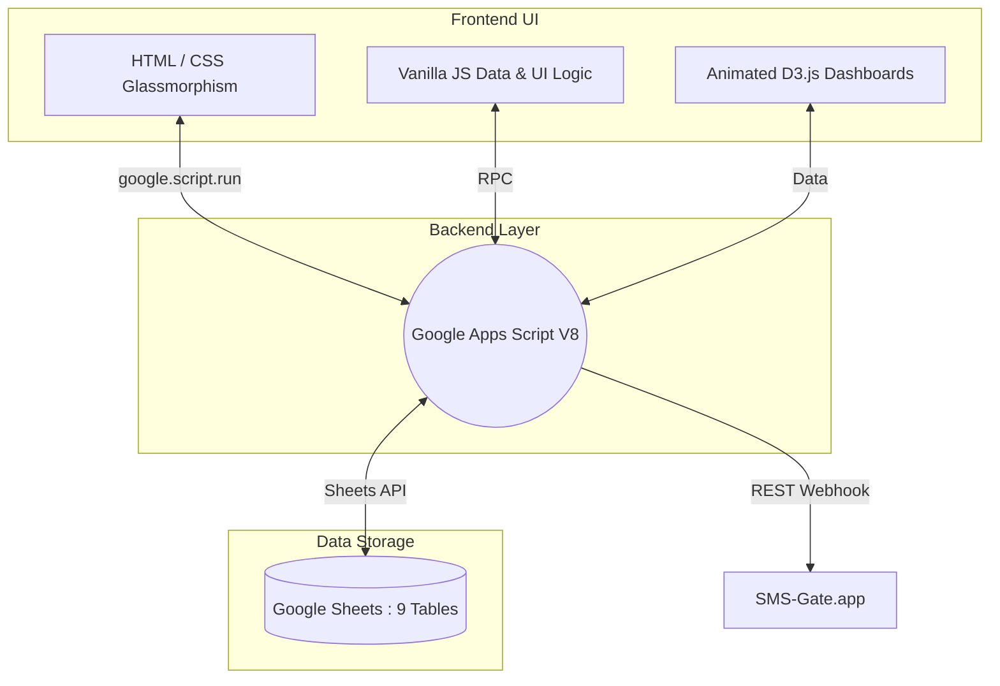

# NARTS — Non-Communicable Disease Appointment & Retention Tracking System

> **Kidus Petros Hospital · NCD Care Department · Addis Ababa, Ethiopia**
> *MVP v1.2 · September 2026*

-f36523?style=for-the-badge)

---

## 🎯 What Is NARTS?

NARTS is a **secure, cloud-based clinical workflow system** built specifically for the NCD chronic care programme at Kidus Petros Hospital. It replaces paper-based appointment registers with a digitally connected, SMS-enabled, Ethiopian-calendar-aware platform — designed for the realities of Ethiopian healthcare delivery.

> [!NOTE]
> **Modern Aesthetic:** NARTS utilizes specific aesthetic principles ("Kidus Petros Theme"), featuring dynamic glassmorphism panels, high-fidelity ECG animations, modern Google typography (`Inter` and `Outfit`), and slick dual-tone gradient buttons.

NARTS enables clinical staff to:
- **Track** all NCD patients across their full care journey
- **Detect** missed appointments automatically in real time
- **Communicate** with patients via Amharic SMS (consent, reminders, outreach)
- **Analyze** retention and adherence trends through interactive and animated dashboards
- **Maintain** a complete, tamper-evident audit trail for every patient interaction

---

## 🌍 Strategic Alignment

NARTS is aligned with the **Ethiopia Digital Health Blueprint 2021–2030** and the **Health Sector Transformation Plan II (HSTP II)**. It directly implements the *Information Revolution* agenda — moving Kidus Petros Hospital toward a data-driven, patient-centered digital health ecosystem while maintaining strict compliance with the **Ethiopian Personal Data Protection Proclamation No. 1321/2024**.

---

## 🏗️ System Architecture at a Glance

> [!TIP]
> **PWA Evolution:** While currently operating under Google Apps Script (`index.html`), NARTS is actively transitioning to a decentralized, Offline-First Progressive Web App (PWA) using `IndexedDB`. This ensures offline clinical use during connectivity outages.

---

## 📚 Document Suite

| # | Document | Primary Audience | Purpose |
|--:|----------|-----------------|---------|
| 1 | [System Architecture, Backend API & Sync Reference](01_system_architecture.md) | Technical / IT | Architecture, REST API catalog, offline-first sync, data-integrity & security rules |
| 2 | [User Manual](02_user_manual.md) | All Clinical Staff | Step-by-step UI guide, voice controls, and data entry rules |
| 3 | [Privacy Policy](03_privacy_policy.md) | Patients & Legal | Data protection under ET Proclamation 1321/2024 |
| 4 | [Terms of Service](04_terms_of_service.md) | All Staff & Legal | Acceptable use, rights, and obligations |
| 5 | [Administrator Guide](05_admin_guide.md) | System Administrators | Setup, Sync troubleshooting, user & security maintenance |
| 6 | [MVP Release Notes & Roadmap](06_mvp_release_notes.md) | Management / IT | Features delivered, PWA roadmap, known limits |
| 7 | [Data Dictionary](07_data_dictionary.md) | Technical / Clinical | All field codes, strict text validations (Amharic mapping) |

---

## ⚖️ Compliance

| Framework | Status |
|-----------|--------|
| Ethiopian Personal Data Protection Proclamation No. 1321/2024 | ✅ Compliant |
| Ethiopia Digital Health Blueprint 2021–2030 | ✅ Aligned |
| Kidus Petros Hospital Internal Data Governance Policy | ✅ Compliant |
| Offline-First Local Data Storage (IndexedDB) | ⏳ In Progress (PWA) |
| HL7 FHIR Integration | 🔲 Planned (Phase 3) |

---

## 📞 Key Contacts

| Role | Responsibility |
|------|---------------|
| **System Administrator** | Account management, initial setup, routing maintenance |
| **NCD Department Head** | Clinical policy oversight, patient data access requests |
| **Hospital IT Department** | Infrastructure & backend connectivity support |
| **Data Protection Officer** | Privacy rights, data breach response, ECA liaison |

---

> *© 2026 Kidus Petros Hospital — NCD Department*  
> *NARTS is an in-house clinical management tool for authorised internal use only.*
