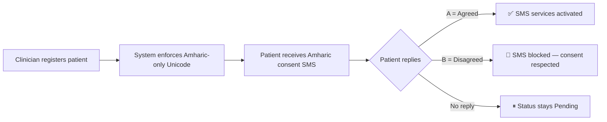
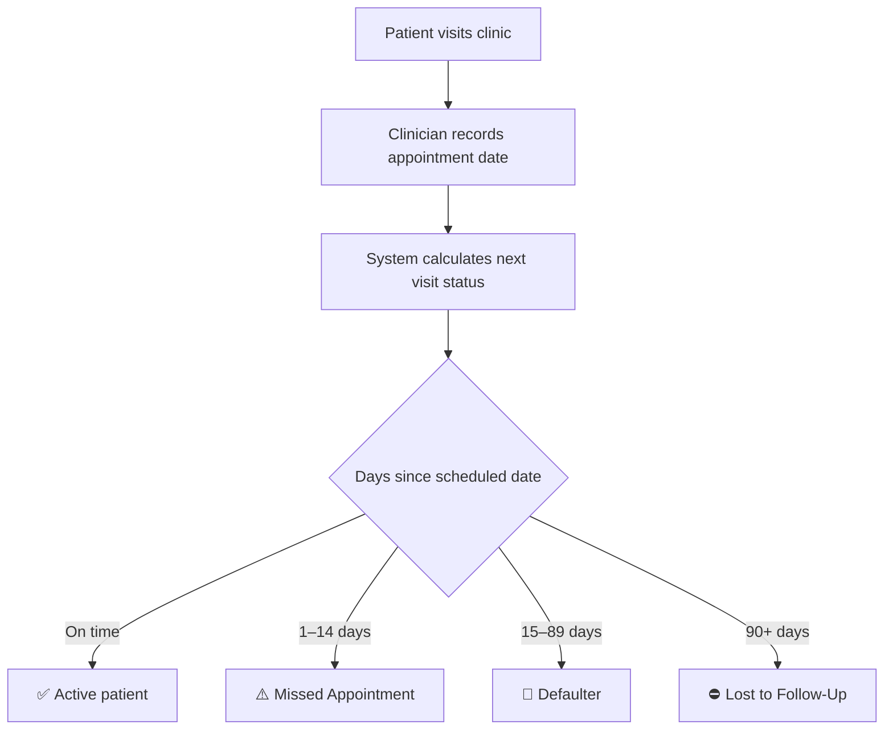

# NARTS — MVP Workflow & Pitch Document

> **Non-Communicable Disease Appointment & Retention Tracking System**
> *St. Peter's Specialized Hospital · Addis Ababa, Ethiopia*
> *MVP v1.1 · March 2026*

---

## 🌩️ The Problem

Ethiopia's NCD burden is accelerating — **over 40% of chronic care patients** at major referral hospitals miss scheduled follow-ups. At St. Peter's Specialized Hospital, **paper-based appointment registers** make it impossible to:

- Detect a missed patient until weeks have passed
- Reach patients proactively with timely reminders
- Measure retention, adherence, or service quality at scale
- Comply with emerging digital health data governance mandates

> [!WARNING]
> **Every missed appointment is a missed opportunity to prevent complications, hospitalizations, and preventable deaths.**

---

## 🌟 The Solution

**NARTS** is a cloud-native, PWA-ready clinical workflow system that digitizes NCD chronic care — from patient registration to automated Amharic SMS outreach, real-time retention animated analytics, and a complete audit trail — at **near-zero infrastructure cost**. It utilizes a modern **Glassmorphism Aesthetic** that reduces cognitive load for clinicians through clear, dynamic visual states.

```
┌──────────────────────────────────────────────────────────────┐
│                     NARTS at a Glance                        │
│                                                              │
│   📋 Register  →  📲 Consent  →  📅 Schedule  →  💬 Remind  │
│                                                              │
│   ⚠️ Detect Missed  →  📞 Trace  →  🔁 Re-engage            │
│                                                              │
│   📊 Analyse  →  💬 Collect Feedback  →  📈 Improve          │
└──────────────────────────────────────────────────────────────┘
```

---

## 🎯 Core Workflows — Objective-Based

### Objective 1: Patient Registration & Informed Consent

**Goal:** Digitize every new NCD patient's record with absolutely uncompromised Amharic data-quality limits and obtain legal SMS consent.



---

### Objective 2: Appointment Lifecycle Management

**Goal:** Track every NCD patient's scheduled and actual visits to identify gaps before they become dangerous.



---

### Objective 3: Automated SMS Patient Engagement

**Goal:** Proactively communicate with patients in Amharic — at the right time, with the right message.

| SMS Type | When Sent | Purpose |
|---|---|---|
| **Consent Request** | On registration | Obtain opt-in permission for SMS |
| **Appointment Reminder** | Day before appointment | Reminds patient with diagnosis-specific arrival time |
| **Missed Alert** | Daily for patients 1–6 days overdue | Urges patient to reschedule |
| **Health Education** | Upon tracing | Provides condition-specific resources |
| **Condolence** | On patient death record | Compassionate bereavement message |

> [!TIP]
> **Localization:** All patient-facing SMS is strictly in **Amharic**, uses the **Ethiopian Calendar**, and automatically translates into **Ethiopian time periods** (ጠዋት / ረፋድ / ከሰዓት).

---

### Objective 4: Patient Retention & Tracing

**Goal:** Close the feedback loop securely using beautiful, custom-built modal dialogues (replacing primitive browser alerts) to keep the UX focused. 

**Tracing outcomes:** Agreed to Return ➔ Not Reachable ➔ Deceased ➔ Transferred Out ➔ Refused.

---

### Objective 5: Medical-Grade Analytics Dashboard

**Goal:** Give clinicians real-time visibility into clinic performance through highly visceral, animated data visualization.

- **Micro-Animations:** Dashboard loading features medical vectors like dynamic ECG traces.
- **Retention Overview:** Missed, defaulter, and LTFU tracks.
- **Drug Adherence Distribution:** Interactive charts analyzing clinical care.

---

### Objective 6: Security & Offline-First Resilience (PWA)

**Goal:** Ensure zero disruption to clinical flows even when the hospital network goes down.

| Capability | Impact |
|---|---|
| **PWA Architecture** | App caches locally in IndexedDB; clinicians keep working during internet drops; data syncs when connectivity restores. |
| **Complete Audit Trail** | Every login, interaction, and structural mutation is permanently tracked. |
| **Strict Validations** | Erases English letters to keep the database natively Amharic-pure. |

---

## 🏆 Why NARTS?

| Feature | Before NARTS | With NARTS |
|---|---|---|
| **Patient tracking** | Paper registers — no alerts | Real-time digital tracking & classification |
| **Missed appointments** | Discovered weeks later | Detected within 24 hours — auto-SMS sent |
| **UX & Aesthetics** | Generic paper / old forms | **Clean Glassmorphism & Fast Animations** |
| **Connectivity** | N/A | **Offline-first PWA Synchronization** |
| **Cost** | Printing, filing, storage | **~$0/month** on Google's infrastructure |

> *NARTS transforms NCD chronic care from reactive paper-based tracking into a proactively beautiful, data-driven, and resilient digital health system.*

---
*© 2026 St. Peter's Specialized Hospital — NCD Department*
