# NARTS SMS Types — Full Analysis

> **Non-Communicable Disease Appointment & Retention Tracking System**
> *Kidus Petros Hospital · Version 1.1 · March 2026*

---

All SMS are routed through the **SMS-Gate API**. The system deeply respects patient **consent status** for clinical messages. Administrative/system messages bypass consent explicitly using the `ignoreConsent=true` flag.

## 📡 The Complete SMS Architecture

```mermaid
sequenceDiagram
    participant Scheduled Trigger
    participant Clinician UI
    participant NARTS Backend
    participant SMS Gateway
    participant Patient Phone

    rect rgb(20, 40, 60)
    Note over Scheduled Trigger, Patient Phone: Automated Nightly Batch (Daily 9 AM EAT)
    Scheduled Trigger->>NARTS Backend: resendSmsForTomorrow()
    NARTS Backend->>NARTS Backend: checkSMSConsent()
    NARTS Backend->>SMS Gateway: Batch POST Payload (Amharic)
    SMS Gateway->>Patient Phone: 📩 Delivery
    end

    rect rgb(60, 30, 20)
    Note over Scheduled Trigger, Patient Phone: Manual Action Feedback Loop
    Clinician UI->>NARTS Backend: triggers sendCondolenceSms()
    NARTS Backend->>SMS Gateway: Instant POST 
    SMS Gateway->>Patient Phone: 📩 Delivery
    Patient Phone->>SMS Gateway: Reply "A"
    SMS Gateway->>NARTS Backend: doPost() Webhook
    end
```

---

## 1. Clinical — Patient Care SMS

| SMS Type | Purpose | Trigger / Timing | Consent Needed? |
|----------|---------|-------------------|:---:|
| **Appointment Reminder** | Reminds patients of scheduled appointment **tomorrow**, including diagnosis-specific arrival time and med instructions. | **Automated daily at 9 AM EAT** (time-triggered). | ✅ Yes |
| **Agreed-to-Return Reminder** | Encouraging tone ("ወደ ክትትል ለመመለስ መወሰነዎ ትልቅ ነገር ነው") for previously traced patients confirming their return tomorrow. | **Automated daily at 9 AM EAT** | ✅ Yes |
| **Missed Appointment** | Notifies patients who **missed their appointment 1–6 days ago**, urging a reschedule. | **Automated daily at 9 PM EAT** | ✅ Yes |
| **Health Education** | Thanks visiting patients and provides link to clinical resources. | **Manual** — care provider clicks "Send Now" button. | ✅ Yes |
| **Condolence** | Sends compassionate Amharic bereavement message. | **Manual** — Triggered via custom alert modal in Tracing. | ✅ Yes |
| **Consent Request** | Asks patients for **opt-in consent**. Replies `A` (agree) or `B` (disagree). | **Automatic** — On patient registration. | ❌ No |
| **Feedback Hook** | Triggers anonymous feedback request to public endpoint. | **Automatic** — After successful appointment save. | ❌ No |

> [!CAUTION]
> If a patient replies `B` (Disagreed) to the Consent Request, the backend permanently throws a block flag. No further clinical SMS will be generated or dispatched.

---

## 2. Administrative — System & User Management SMS

| SMS Type | Purpose | Trigger / Timing | Consent Needed? |
|----------|---------|-------------------|:---:|
| **Welcome / Registration** | Notifies new care provider their account is pending admin approval. | **Automatic** — On user registration. | ❌ No |
| **Account Approval** | Notifies care provider their account was approved to log in. | **Automatic** — On admin approval. | ❌ No |
| **Password Request Notification** | Alerts Admin that a specific clinician requested a reset. | **Automatic** — On user password reset request. | ❌ No |
| **Password Fulfillment** | Sends the temporary password back to the requesting user. | **Automatic** — When Admin executes reset. | ❌ No |

---

## 3. Custom / Bulk SMS

| SMS Type | Purpose | Trigger / Timing | Consent Needed? |
|----------|---------|-------------------|:---:|
| **Custom Batch SMS** | Admin-only bypass to send free-text broadcasts (e.g. Clinic closures, widespread health alerts). | **Manual** from Admin module. | ❌ No |

---

## 4. SMS Relational Logging Schema

Every outgoing message is recorded immutably to the `SMS` database sheet:

| Column | Logged Metric |
|:------:|---------------|
| A | `patient_id` |
| B | `care_provider_id` |
| C | `consent_sms` Timestamp |
| D | `reminder_sms` Timestamp |
| E | `education_sms` Timestamp |
| F | `appointment_miss_sms` Timestamp |
| G | `remind_returnVisit_sms` Timestamp |
| H | `condolence_sms` Timestamp |
| I | `Miscellaneous` Timestamp |
| J | `time_stamp` (Global Row Stamp) |

---
*© 2026 Kidus Petros Hospital · NCD Department — Internal Technical Reference*
